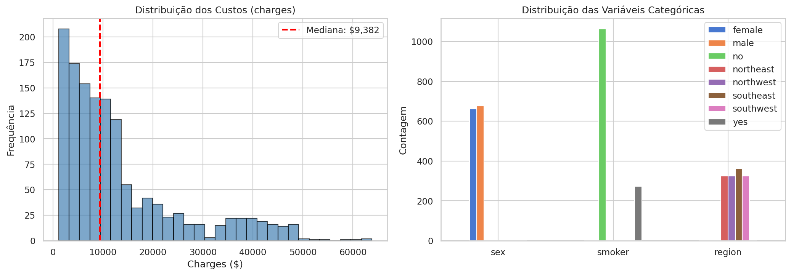
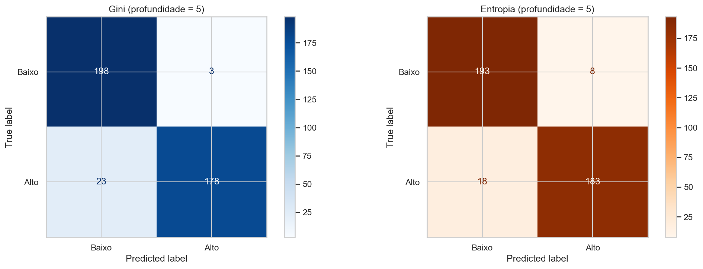
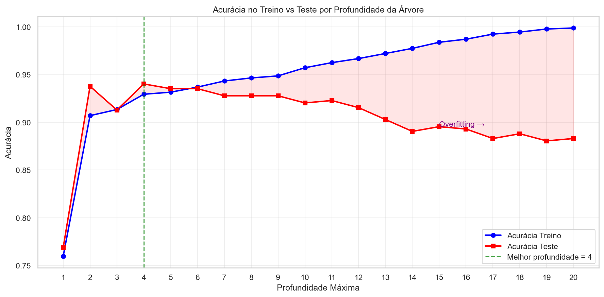
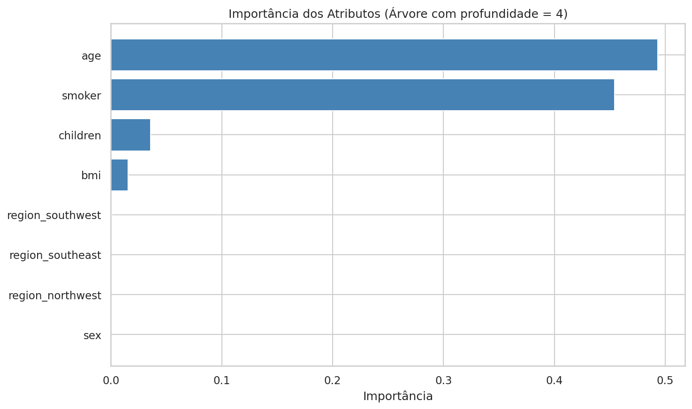
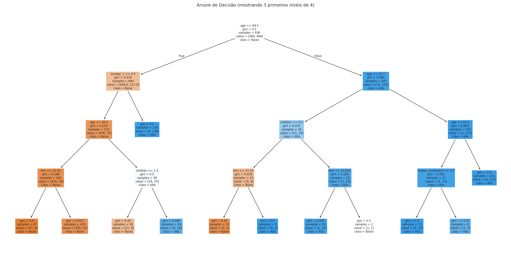

# Classificacao de Custo de Seguro Saude com Arvore de Decisao

Projeto de Aprendizado de Maquina que aplica o algoritmo de **Arvore de Decisao** para classificar pacientes em **"custo alto"** ou **"custo baixo"** de seguro saude, variando os parametros de criterio de divisao (Gini vs Entropia) e profundidade maxima da arvore.

## Base de Dados

- **Dataset:** Insurance
- **Registros:** 1.338
- **Atributos:** 7 (`age`, `sex`, `bmi`, `children`, `smoker`, `region`, `charges`)
- **Variavel alvo:** `charges` transformada em classificacao binaria (acima/abaixo da mediana de $9.382)

## Tecnologias

- Python
- Scikit-learn (`DecisionTreeClassifier`)
- Pandas / NumPy
- Matplotlib

## Como Executar

```bash
python -m venv venv
source venv/bin/activate
pip install -r requirements.txt
jupyter notebook main.ipynb
```

## Etapas do Projeto

### 1. Importacao de Bibliotecas

Importacao das bibliotecas necessarias para manipulacao de dados, visualizacao e modelagem.

### 2. Carregamento e Exploracao dos Dados

Analise exploratoria da base de dados, incluindo estatisticas descritivas, distribuicao dos custos e das variaveis categoricas.



- A distribuicao dos custos e assimetrica a direita, com a maioria dos pacientes concentrados em valores mais baixos.
- A mediana dos custos e de $9.382, utilizada como limiar para a classificacao binaria.
- As variaveis categoricas apresentam distribuicao relativamente equilibrada, exceto `smoker` (maioria nao fumante).

### 3. Pre-processamento

- Criacao da variavel alvo binaria: pacientes com custo acima da mediana sao classificados como "alto" e abaixo como "baixo", resultando em classes perfeitamente balanceadas (50%/50%).
- Codificacao de variaveis categoricas com Label Encoding (binarias) e One-Hot Encoding (regiao).

### 4. Divisao Treino/Teste

Divisao estratificada dos dados em 70% treino (936 amostras) e 30% teste (402 amostras).

### 5. Variacao 1: Criterio de Divisao (Gini vs Entropia)

Comparacao entre os criterios Gini e Entropia com profundidade fixa de 5.



| Criterio | Acuracia | Precision (Alto) | Recall (Alto) | F1-Score (Alto) |
|----------|----------|-------------------|---------------|-----------------|
| Gini     | 0.9353   | 0.98              | 0.89          | 0.93            |
| Entropia | 0.9353   | 0.96              | 0.91          | 0.93            |

Ambos os criterios alcancaram a mesma acuracia (93,53%), confirmando que na pratica Gini e Entropia tendem a produzir resultados similares.

### 6. Variacao 2: Profundidade Maxima da Arvore

Teste de profundidades de 1 a 20, demonstrando o trade-off entre underfitting e overfitting.



- **Arvores rasas** (profundidade 1-2): underfitting, acuracia baixa em treino e teste.
- **Arvores profundas** (sem limite): overfitting, acuracia de 100% no treino mas queda para ~87,5% no teste.
- **Melhor profundidade:** 4, com acuracia de teste de 94,03%.

### 7. Modelo Final e Analise

Modelo final treinado com criterio Gini e profundidade maxima de 4, alcancando **94,03% de acuracia**.



Os atributos mais importantes para a classificacao foram:
1. **age** (0.4976) - idade do paciente
2. **smoker** (0.4498) - se o paciente e fumante
3. **children** (0.0381) - numero de dependentes



A visualizacao da arvore mostra os 3 primeiros niveis de decisao, com a primeira divisao sendo feita pelo atributo `age <= 49.5`.

### 8. Tabela Comparativa

| Criterio | Prof. Max  | Acuracia Treino | Acuracia Teste | Diferenca |
|----------|------------|-----------------|----------------|-----------|
| Gini     | 3          | 0.9135          | 0.9129         | 0.0005    |
| Gini     | 5          | 0.9316          | 0.9353         | -0.0037   |
| Gini     | 10         | 0.9573          | 0.9204         | 0.0369    |
| Gini     | Sem limite | 1.0000          | 0.8756         | 0.1244    |
| Entropy  | 3          | 0.9081          | 0.9129         | -0.0048   |
| Entropy  | 5          | 0.9231          | 0.9353         | -0.0122   |
| Entropy  | 10         | 0.9605          | 0.9303         | 0.0301    |
| Entropy  | Sem limite | 1.0000          | 0.8856         | 0.1144    |

## Conclusao

- **Gini vs Entropia:** Resultados praticamente identicos, consistente com a literatura.
- **Profundidade:** O controle da profundidade e essencial para evitar overfitting. A profundidade ideal (4) equilibra complexidade e generalizacao.
- **Atributos relevantes:** `smoker` e `age` dominam a classificacao, somando ~95% da importancia total.
- O projeto demonstra na pratica os conceitos de **overfitting**, **underfitting** e **poda** (pruning) em Arvores de Decisao.
